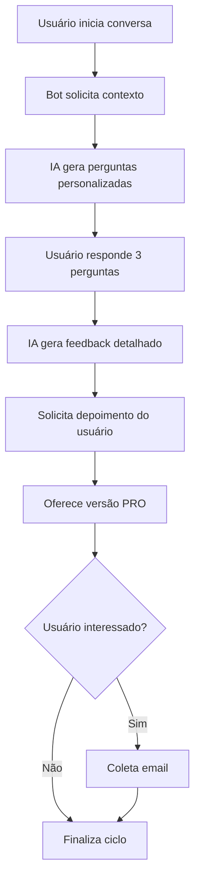

# 🤖 Bot de Entrevista MVP - WhatsApp

Um chatbot inteligente para WhatsApp que simula entrevistas de emprego personalizadas, oferecendo feedback detalhado usando IA generativa e coletando leads para versão PRO.

## 🌟 Funcionalidades

### Core Features

-   **Entrevistas Personalizadas**: Gera 3 perguntas (2 soft skills + 1 hard skill) baseadas no contexto do candidato
-   **Suporte Multimodal**: Aceita respostas por texto ou áudio com transcrição automática
-   **Feedback Inteligente**: Análise detalhada usando metodologia STAR com pontuação de clareza
-   **WhatsApp Integration**: Interface familiar via WhatsApp usando Twilio
-   **Processamento Assíncrono**: Workers Celery para melhor performance

### Funcionalidades de Negócio

-   **Coleta de Feedback**: Depoimentos qualitativos dos usuários
-   **Lead Generation**: Coleta de emails para versão PRO com validação
-   **Logging Estruturado**: Métricas detalhadas para análise de conversão
-   **Análise de Logs**: Script dedicado para métricas de negócio

## 📊 Métricas Coletadas

O sistema coleta automaticamente:

-   Novos usuários detectados
-   Taxa de conversão usuário → entrevista
-   Taxa de conclusão das entrevistas
-   Feedbacks qualitativos dos usuários
-   Interesse na versão PRO
-   Emails coletados para marketing

## 🛠️ Stack Tecnológica

| Componente         | Tecnologia                               |
| ------------------ | ---------------------------------------- |
| **Backend**        | FastAPI + Python 3.8+                    |
| **IA Generativa**  | Google Vertex AI (Gemini 2.5 Flash Lite) |
| **Messaging**      | Twilio WhatsApp API                      |
| **Speech-to-Text** | Google Cloud Speech API                  |
| **Queue/Cache**    | Redis + Celery                           |
| **Logging**        | Python JSON Logger                       |
| **Tunneling**      | ngrok                                    |

## 📋 Pré-requisitos

-   Python 3.8+
-   Docker (para Redis)
-   Conta Google Cloud Platform com APIs habilitadas
-   Conta Twilio com WhatsApp sandbox configurado
-   ngrok instalado

## ⚙️ Configuração

### 1. Credenciais Google Cloud

1. Crie um projeto no [Google Cloud Console](https://console.cloud.google.com/)
2. Ative as APIs necessárias:
    - Vertex AI API
    - Speech-to-Text API
3. Crie uma Service Account com as permissões:
    - Vertex AI User
    - Speech Client
4. Baixe o arquivo JSON e renomeie para `google_credentials.json`
5. Coloque na raiz do projeto

### 2. Configuração Twilio WhatsApp

1. Crie conta no [Twilio Console](https://console.twilio.com/)
2. Acesse WhatsApp Sandbox
3. Configure o número de teste
4. Anote: Account SID, Auth Token, WhatsApp Number

### 3. Variáveis de Ambiente

Crie o arquivo `.env` na raiz do projeto:

```env
# Google Cloud
ID_PROJETO=seu-projeto-gcp

# Twilio WhatsApp
TWILIO_ACCOUNT_SID=ACxxxxxxxxxxxxxxxxxxxx
TWILIO_AUTH_TOKEN=xxxxxxxxxxxxxxxxxxxxxxxxx
TWILIO_WHATSAPP_NUMBER=whatsapp:+14155238886
```

## 🚀 Instalação e Execução

### 1. Clone e Configure

```bash
git clone <seu-repositorio>
cd bot-entrevista-mvp
pip install -r requirements.txt
```

### 2. Iniciar Infraestrutura

```bash
# Iniciar Redis
docker run --name meu-redis -p 6379:6379 -d redis

# Verificar se está rodando
docker ps
```

### 3. Executar Aplicação

**Terminal 1 - Worker Celery:**

```bash
celery -A main.celery worker --loglevel=info --pool=solo
```

**Terminal 2 - Servidor FastAPI:**

```bash
uvicorn main:app --reload --host 0.0.0.0 --port 8000
```

**Terminal 3 - Exposição Pública:**

```bash
ngrok http 8000
```

### 4. Configurar Webhook Twilio

1. Copie a URL do ngrok: `https://abc123.ngrok-free.app`
2. No Twilio Console → WhatsApp Sandbox
3. Configure webhook: `https://abc123.ngrok-free.app/webhook/twilio`

## 🔄 Fluxo do Usuário



### Estados Internos

| Estado                        | Descrição                                |
| ----------------------------- | ---------------------------------------- |
| `aguardando_contexto`         | Coletando vaga, experiência, tecnologias |
| `preparando_perguntas`        | IA gerando perguntas via Celery          |
| `aguardando_resposta_N`       | Coletando respostas (N = 1,2,3)          |
| `gerando_feedback`            | IA analisando respostas                  |
| `aguardando_feedback_usuario` | Coletando depoimento                     |
| `aguardando_email_pro`        | Validando email para versão PRO          |

## 📈 Análise de Métricas

Execute o script de análise para visualizar métricas:

```bash
python analisar_logs.py [arquivo_logs.jsonl]
```

### Métricas Disponíveis

-   **Conversão**: Usuário → Entrevista → Conclusão
-   **Engagement**: Feedbacks qualitativos coletados
-   **Lead Generation**: Taxa de interesse na versão PRO
-   **Depoimentos**: Feedback qualitativo dos usuários
-   **Emails**: Base de leads para marketing

## 🏗️ Arquitetura

```
┌─────────────────┐    ┌──────────────┐    ┌─────────────────┐
│   WhatsApp      │    │   Twilio     │    │   FastAPI       │
│   Usuário       │◄──►│   Webhook    │◄──►│   Webhook       │
└─────────────────┘    └──────────────┘    └─────────────────┘
                                                     │
                       ┌─────────────────────────────┼─────────────────────────────┐
                       │                             │                             │
                ┌──────▼──────┐              ┌──────▼──────┐              ┌──────▼──────┐
                │   Redis     │              │   Celery    │              │  Google     │
                │   Cache     │              │   Workers   │              │  Cloud AI   │
                └─────────────┘              └─────────────┘              └─────────────┘
                                                     │
                                             ┌──────▼──────┐
                                             │  Structured │
                                             │   Logging   │
                                             └─────────────┘
```

## 🧪 Teste de Carga

Execute testes de concorrência:

```bash
# Editar URL no arquivo teste_carga.py
python teste_carga.py
```

## 🔧 Troubleshooting

### ❌ Problemas Comuns

**Redis não conecta:**

```bash
docker ps                    # Verificar containers
docker restart meu-redis     # Reiniciar se necessário
docker logs meu-redis        # Ver logs
```

**Celery Worker travando:**

```bash
# Windows - usar pool=solo
celery -A main.celery worker --loglevel=info --pool=solo

# Linux/Mac - pool padrão
celery -A main.celery worker --loglevel=info
```

**Webhook não recebe:**

1. ✅ ngrok ativo: `ngrok http 8000`
2. ✅ URL correta no Twilio Console
3. ✅ Teste manual: `curl https://sua-url.ngrok.io/webhook/twilio`

**Transcrição falha:**

-   ✅ APIs Google Cloud habilitadas
-   ✅ Credenciais `google_credentials.json` válidas
-   ✅ Testar primeiro com texto

## 📂 Estrutura do Projeto

```
bot-entrevista-mvp/
├── 📄 main.py                   # Aplicação principal FastAPI
├── 📄 analisar_logs.py          # Script análise de métricas
├── 📄 teste_carga.py            # Testes de performance
├── 📄 requirements.txt          # Dependências Python
├── 📄 .env                      # Variáveis ambiente (local)
├── 📄 .gitignore               # Arquivos ignorados
├── 🔑 google_credentials.json   # Credenciais GCP (não versionado)
├── 📊 logs.jsonl               # Logs estruturados (gerado)
└── 📖 README.md                # Esta documentação
```

## 🔒 Segurança

-   ✅ Credenciais não versionadas (`.env`, `google_credentials.json`)
-   ✅ Logs estruturados sem dados sensíveis
-   ✅ Validação de email com regex
-   ✅ Rate limiting via Twilio
-   ⚠️ **Produção**: Configure HTTPS, firewall, monitoramento

## 📝 Comandos Úteis

```bash
# 🚀 Start completo
docker start meu-redis && \
celery -A main.celery worker --loglevel=info --pool=solo & \
uvicorn main:app --reload & \
ngrok http 8000

# 🔍 Debug
docker logs meu-redis                           # Logs Redis
docker exec -it meu-redis redis-cli FLUSHALL    # Limpar cache
python analisar_logs.py                         # Ver métricas

# 🧪 Teste webhook local
curl -X POST http://localhost:8000/webhook/twilio \
  -d "From=whatsapp:+5511999999999&Body=teste"
```

## 🎯 Roadmap

### 📋 Próximas Features

-   [ ] Dashboard web para métricas
-   [ ] Persistência PostgreSQL
-   [ ] Suporte multi-idioma
-   [ ] Integração calendário agendamento
-   [ ] Análise sentiment dos feedbacks

### 🚀 Versão PRO (Planejada)

-   [ ] Análise de vídeo/comunicação não-verbal
-   [ ] Relatórios PDF personalizados
-   [ ] Banco de perguntas expandido
-   [ ] Simulações por área específica
-   [ ] API para integrações

## 📞 Suporte

**Debug checklist:**

1. ✅ Redis conectado: `docker ps`
2. ✅ Celery worker ativo: verificar logs
3. ✅ FastAPI rodando: `http://localhost:8000`
4. ✅ ngrok expondo: verificar URL pública
5. ✅ Webhook configurado no Twilio
6. ✅ Credenciais `.env` e `google_credentials.json`

**Logs importantes:**

-   Celery worker logs → erros de processamento IA
-   FastAPI logs → erros de webhook/API
-   `logs.jsonl` → métricas de negócio
-   Docker logs → problemas Redis

---

💡 **Dica**: Para desenvolvimento, mantenha 4 terminais abertos: Redis, Celery, FastAPI e ngrok.
